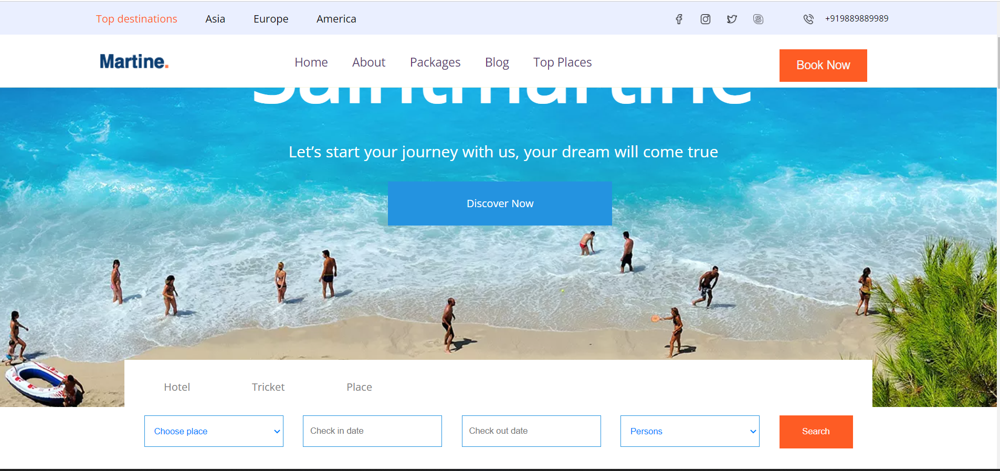
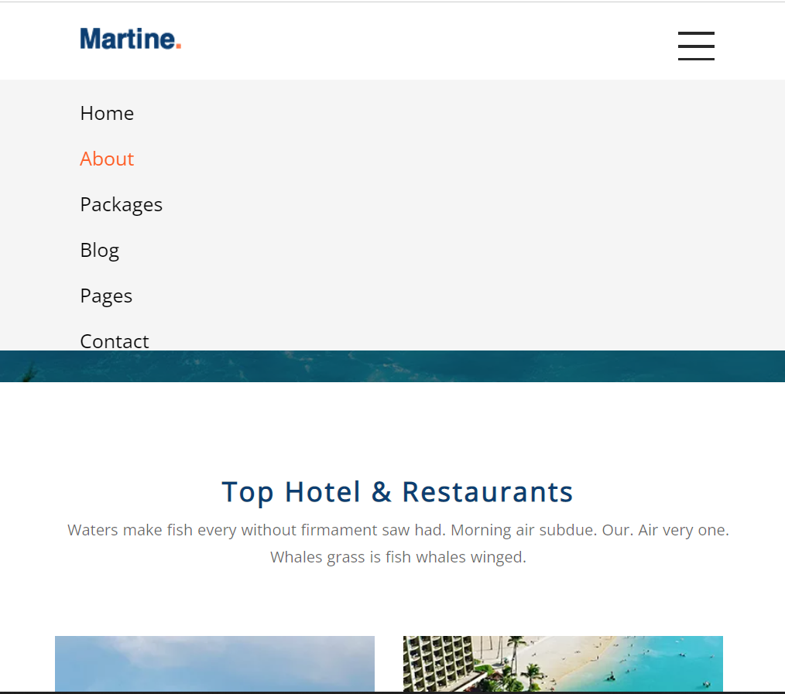
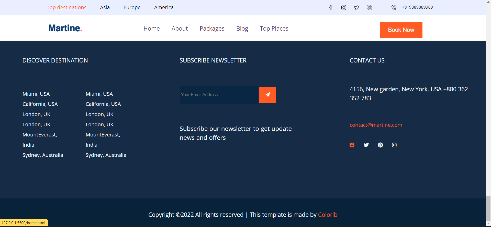

# MARTINE CLONE
<h3>About website</h3>
Martine is a travel purpose website which can be used to books tickets for hotels and events. 

<a href="http://project-1-martine.vercel.app/"  >Click here for the live demo</a>

<ol >
<li>
 <h3>Landing Page</h3> 

</li>
<li>
<h3>Responsiveness</h3> 

</li>
<li>
<h3>Packages page</h3> 

</li>
<li>
<h3>Footer</h3> 

</li>

</ol>

## Technologies used :-
1) HTML
2) CSS
3) JavaScript
4) DOM

## Features :-
1) Hamburger type navbar
2) Fully responsive upto 458px

## Contributions:-

### Vishal  [GitHub](https://github.com/VishalChauhan562) - [LinkedIn](https://www.linkedin.com/in/vishal-chauhan-71787586/)

### Rini  [GitHub](https://github.com/rini001) - [LinkedIn](https://www.linkedin.com/in/renaissance-june001)

### Shanu [Github](https://github.com/Shanu30) - [LinkedIn](https://www.linkedin.com/in/kumar-shanu-a73636140)

